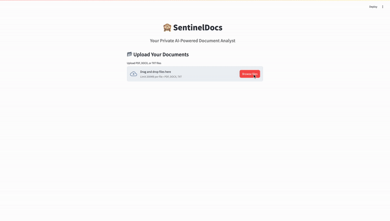
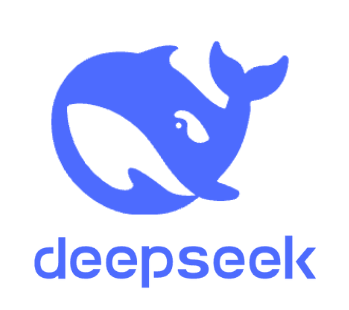

# 🙈 SentinelDocs

<div align="center">


<p align="center">
  <b>Your Private AI-Powered Document Analyst</b><br>
  <i>Analyze documents privately with local AI models. No data leaves your machine.</i>
</p>



</div>

## 🌟 Features

<table>
  <tr>
    <td>
      <ul>
        <li>📂 <b>Multi-format Document Support</b>: PDF, DOCX, TXT</li>
        <li>🔍 <b>AI-Powered Semantic Search</b>: Natural language queries</li>
        <li>📊 <b>Document Statistics</b>: Word count, entities, etc.</li>
        <li>📑 <b>Cross-Document Comparison</b>: Find similarities & differences</li>
      </ul>
    </td>
    <td>
      <ul>
        <li>📋 <b>Entity Recognition</b>: Extract key people, organizations, etc.</li>
        <li>📄 <b>PDF Report Generation</b>: Download comprehensive insights</li>
        <li>🛡️ <b>100% Private</b>: All processing happens locally</li>
        <li>🧩 <b>Multiple AI Models</b>: Choose your local LLM</li>
      </ul>
    </td>
  </tr>
</table>

## 🤖 Supported Models

SentinelDocs works with various [Ollama](https://ollama.ai) models. I have tested with:

<div align="center">
  <table>
    <tr>
      <td align="center"><br><b>DeepSeek-R1</b><br><small>Recommended</small></td>
      <td align="center"><br><b>Mistral</b></td>
      <td align="center"><br><b>Llama 3</b></td>
    </tr>
  </table>
</div>

## 📋 Requirements

- Python 3.8+ (3.10 recommended)
- Ollama with LLM models installed (e.g., deepseek-r1:8b)
- macOS, Linux, or Windows with WSL (for Ollama)

## 🚀 Installation

### 1. Set Up Python Environment

For macOS users:
```bash
# Install Homebrew if not already installed
/bin/bash -c "$(curl -fsSL https://raw.githubusercontent.com/Homebrew/install/HEAD/install.sh)"

# Install Python if needed
brew install python@3.10
```

### 2. Clone the Repository
```bash
git clone https://github.com/MayurHulke/SentinelDocs.git
cd SentinelDocs
```

### 3. Set Up Environment & Install Dependencies

**Option A: Using Conda (Recommended for macOS/Linux)**
```bash
# Install conda if you don't have it already
# Install miniconda: https://docs.conda.io/en/latest/miniconda.html

# Create and activate the environment from the provided file
conda env create -f environment.yml
conda activate sentineldocs

# Download spaCy model
python -m spacy download en_core_web_sm
```

**Option B: Using pip and requirements.txt**
```bash
# Optional: Create a virtual environment
python -m venv sentineldocs_env
source sentineldocs_env/bin/activate  # On macOS/Linux
# or
sentineldocs_env\Scripts\activate  # On Windows

# Install dependencies
pip install -r requirements.txt
python -m spacy download en_core_web_sm
```

### 4. Install and Run Ollama

1. Download and install Ollama from [https://ollama.ai](https://ollama.ai)
2. Start the Ollama service
3. Pull a model:
   ```bash
   ollama pull deepseek-r1:8b
   # Optional: Pull additional models
   ollama pull mistral
   ollama pull llama3
   ```

## 🖥️ Usage

1. Start the application:
   ```bash
   streamlit run app.py
   ```

2. Open your browser and navigate to the URL displayed in the terminal (typically http://localhost:8501)

3. Upload your documents and explore all features

<div align="center">
  
</div>

## 🛠️ Troubleshooting

### Common Issues and Solutions

1. **Watchdog Warning**:
   If you see a warning about Watchdog, install it for better performance:
   ```bash
   xcode-select --install  # For macOS users
   pip install watchdog
   ```

2. **LangChain Deprecation Warnings**:
   These warnings don't affect functionality but can be fixed by updating the imports in the code:
   ```python
   # Change:
   from langchain_community.llms import Ollama
   # To:
   from langchain_ollama import OllamaLLM
   ```

3. **Ollama Connection Issues**:
   - Ensure Ollama is running in the background
   - Verify you have pulled the required models: `ollama list`
   - Check Ollama logs if models fail to load

4. **Package Conflicts**:
   If you encounter package version conflicts, consider using a virtual environment or conda environment as described in the installation section.

5. **Empty Label Warnings**:
   These are UI warnings from Streamlit that don't affect functionality.

6. **Torch Warning About __path__._path**:
   This is a known issue with some versions of PyTorch and Streamlit but doesn't affect functionality.

## ⚙️ How It Works

<div align="center">
  <table>
    <tr>
      <td align="center"><b>1️⃣</b><br>Document<br>Processing</td>
      <td align="center"><b>2️⃣</b><br>Semantic<br>Indexing</td>
      <td align="center"><b>3️⃣</b><br>NLP<br>Analysis</td>
      <td align="center"><b>4️⃣</b><br>AI-Powered<br>Response</td>
    </tr>
  </table>
</div>

1. **Document Processing**: Extracts text from uploaded files
2. **Document Indexing**: Creates a semantic index using FAISS for efficient retrieval
3. **NLP Analysis**: Uses spaCy for entity recognition and basic document statistics
4. **Semantic Search**: When you ask a question, finds the most relevant document passages
5. **AI Response Generation**: Uses the Ollama LLM to generate responses based on the relevant context

## 🔧 Customization

- **Change Default Model**: Select your preferred model from the dropdown in the sidebar
- **Adjust Chunk Size**: Modify the `chunk_size` parameter in the code for different document segmentation
- **Response Length**: Adjust the text context length in the `generate_response` function

## 👥 Contributing

Contributions are welcome! Please feel free to submit a Pull Request.

## 📜 License

This project is licensed under the MIT License - see the LICENSE file for details.

